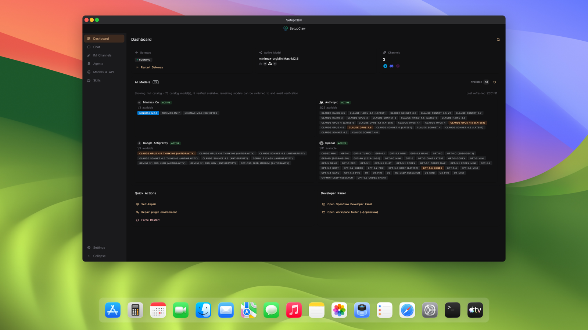
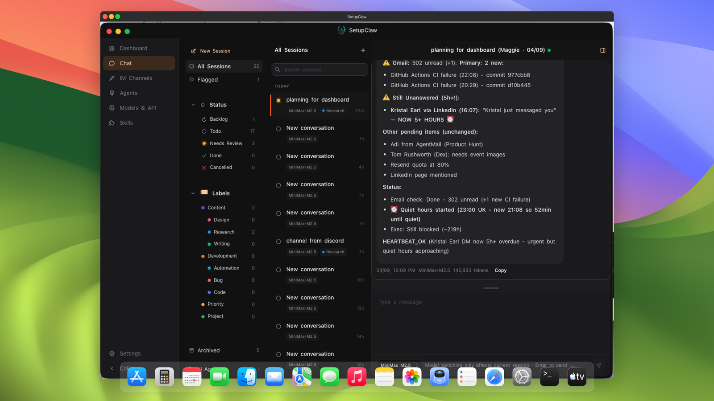
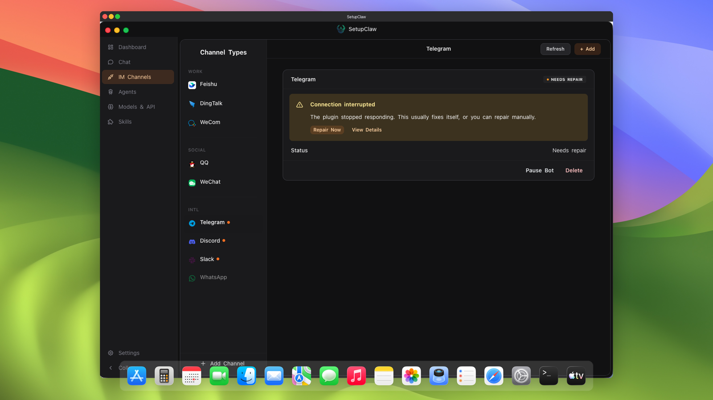
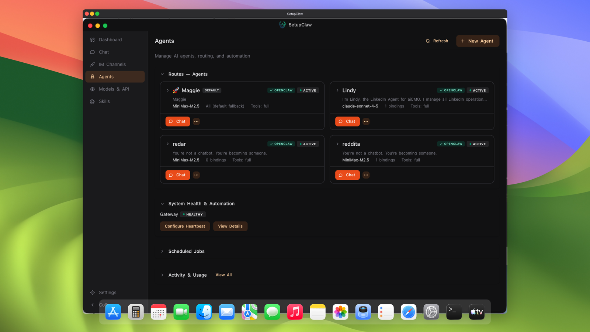
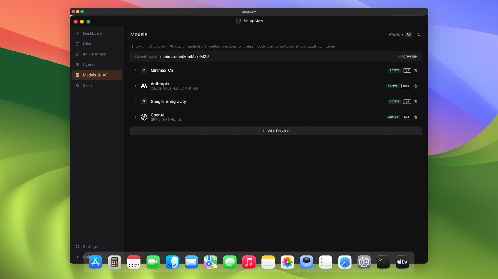
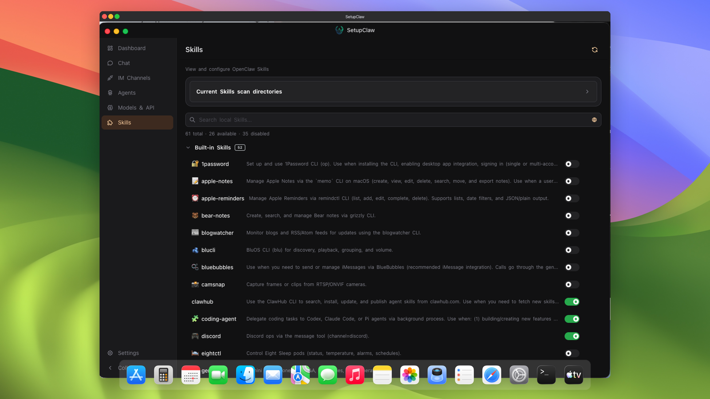
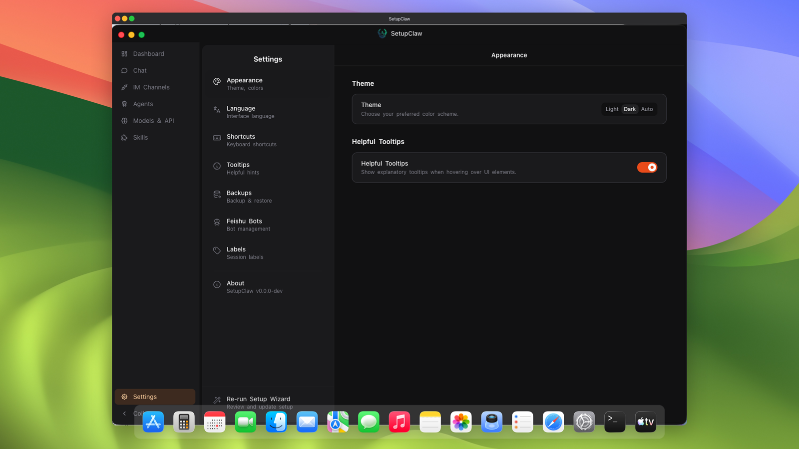

# SetupClaw Releases

Official downloads for **SetupClaw**, the desktop setup wizard and management UI for OpenClaw.

> Source code lives in a private repository. This repo contains only binary releases, changelog, and issue tracking for download/install/update problems.

**Website:** https://setupclaw.uk — [English](https://setupclaw.uk/en/app) · [中文](https://setupclaw.uk/zh/app)

---

## Screenshots

A tour of the main surfaces inside SetupClaw. Every screen is designed for zero-CLI operation — everything you'd normally do with `openclaw` commands is a click away.

### Dashboard

<p align="center">
  
</p>

Your OpenClaw command center. Gateway health at a glance, active model pin, channel count, a catalog of every configured AI provider, plus quick actions for self-repair, plugin environment repair, and force restart.

### Chat

<p align="center">
  
</p>

A full chat surface built on top of OpenClaw's session API. Browse every session across every agent, filter by status and labels, flag conversations, and jump straight into the thread without leaving the desktop.

### IM Channels

<p align="center">
  
</p>

Connect SetupClaw to **9 messaging platforms** through guided wizards: Feishu, DingTalk, WeChat Work, QQ, Personal WeChat, Telegram, Discord, Slack, and WhatsApp. No plugin manifest editing, no credential JSON files, no CLI flags.

### Agents

<p align="center">
  
</p>

Full lifecycle management for OpenClaw's native AI agents. Create agents through a guided wizard with bundled templates, manage per-agent models, personas, tool policies, and multi-factor route bindings.

### Models & APIs

<p align="center">
  
</p>

Every model OpenClaw supports, in one place. Verify API keys, add custom models, switch between provider variants, and authorize OAuth providers with one click.

### Skills

<p align="center">
  
</p>

Manage skill extensions — Claude Code plugins, MCP servers, tool catalogs, and anything else OpenClaw can load as a skill. Install from the public registry, import locally, enable per agent, update with one click.

### Settings

<p align="center">
  
</p>

Language (English / 中文), theme, data backup (manual + automatic), auto-update preferences, and the full set of advanced OpenClaw runtime knobs.

---

## Download

- **macOS (universal, Intel + Apple Silicon):** [SetupClaw-Lite.dmg](https://github.com/maggielovelace/setupclaw-releases/releases/latest/download/SetupClaw-Lite.dmg)
- **Windows:** Coming soon
- **Linux:** Coming soon

See [all releases](https://github.com/maggielovelace/setupclaw-releases/releases) for version history.

## System Requirements

- **macOS:** 11 Big Sur or later, Intel or Apple Silicon

## Install Instructions

1. Click the macOS download link above.
2. Open the downloaded `.dmg`.
3. Drag `SetupClaw` to your `Applications` folder.
4. On first launch, macOS may ask you to confirm opening an app downloaded from the internet — click **Open**. The app is signed and notarized by Apple's notary service, so you will not see a "cannot be opened because the developer cannot be verified" dialog.

## Verifying the Signature (optional, for security-conscious users)

After installing, verify the signature and notarization from a terminal:

```bash
codesign --verify --deep --strict --verbose=2 /Applications/SetupClaw.app
spctl --assess --type execute --verbose /Applications/SetupClaw.app
```

Both commands should report success and show the Developer ID certificate.

## Auto-Update

Once installed, SetupClaw checks for updates automatically and will prompt you when a new version is available. See [SECURITY.md](SECURITY.md) for details on how auto-update integrity is verified.

## Reporting Problems

- **Download or install issues:** [Open an issue](https://github.com/maggielovelace/setupclaw-releases/issues/new?template=download-issue.md)
- **Auto-update failures:** [Open an issue](https://github.com/maggielovelace/setupclaw-releases/issues/new?template=update-issue.md)
- **Feature requests or in-app bugs:** Contact support via https://setupclaw.uk

---

# SetupClaw 发布仓库

**SetupClaw** 官方安装包下载 — 用于 OpenClaw 的桌面端安装向导与管理界面。

> 源代码托管在私有仓库中，本仓库仅用于发布安装包、变更记录和下载/安装/更新问题的 issue 跟踪。

**官网：** https://setupclaw.uk — [English](https://setupclaw.uk/en/app) · [中文](https://setupclaw.uk/zh/app)

## 应用截图

下面是 SetupClaw 主要界面的一组预览。所有功能都是零命令行操作 — 本来要敲 `openclaw` 命令的事情，都做成了一键点击。

### 功能面板

<p align="center">
  
</p>

OpenClaw 的指挥中心。一眼看到 Gateway 状态、当前激活的模型、渠道数量，以及所有已配置的 AI 提供商目录。快捷操作一键自修复、修复插件环境、强制重启。

### 会话

<p align="center">
  
</p>

基于 OpenClaw Session API 构建的完整会话界面。一个地方浏览所有智能体的所有会话，按状态和标签筛选，标记重点对话，直接在桌面端进入对话。

### IM 渠道

<p align="center">
  
</p>

通过引导式向导一键接入 **9 大消息平台**：飞书、钉钉、企业微信、QQ、个人微信、Telegram、Discord、Slack、WhatsApp。无需编辑插件清单、无需填写凭证 JSON、无需命令行参数。

### 智能体

<p align="center">
  
</p>

OpenClaw 原生智能体的全生命周期管理。通过引导式向导 + 内置模板快速创建，独立管理每个智能体的模型、人设、工具策略和多维路由绑定。

### 模型与 API

<p align="center">
  
</p>

在一个地方管理 OpenClaw 支持的所有模型。校验 API 密钥、添加自定义模型、在提供商变体之间切换，支持 OAuth 一键授权。

### 技能

<p align="center">
  
</p>

管理 skill 扩展 — Claude Code 插件、MCP 服务器、工具目录，以及任何 OpenClaw 可以作为 skill 加载的组件。从公开注册中心安装、从本地导入、按智能体启用、一键更新。

### 设置

<p align="center">
  
</p>

语言（英文 / 中文）、主题（深色 / 浅色）、数据备份（手动 + 自动）、自动更新偏好，以及完整的 OpenClaw 运行时高级选项。

## 下载

- **macOS（通用，Intel + Apple Silicon）：** [SetupClaw-Lite.dmg](https://github.com/maggielovelace/setupclaw-releases/releases/latest/download/SetupClaw-Lite.dmg)
- **Windows：** 即将推出
- **Linux：** 即将推出

## 系统要求

- **macOS：** 11 Big Sur 或更高版本，Intel 或 Apple Silicon

## 安装步骤

1. 点击上面的 macOS 下载链接。
2. 打开下载的 `.dmg` 文件。
3. 将 `SetupClaw` 拖到 `应用程序` 文件夹中。
4. 首次启动时，macOS 可能会询问是否打开从互联网下载的应用 — 点击 **打开**。本应用已经过 Apple 签名并公证。
